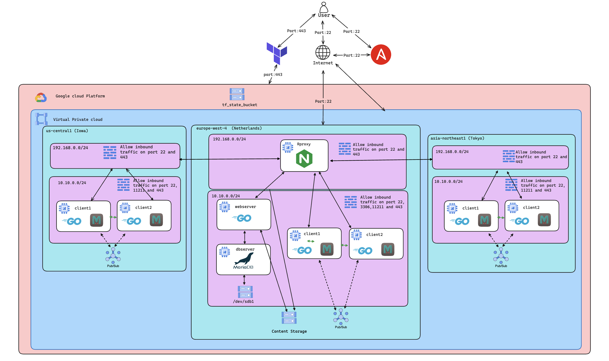
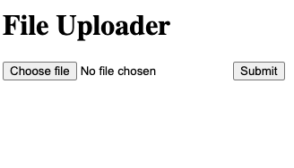
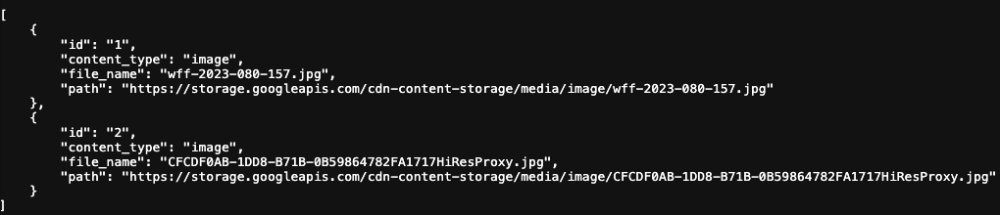
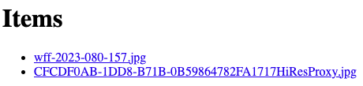
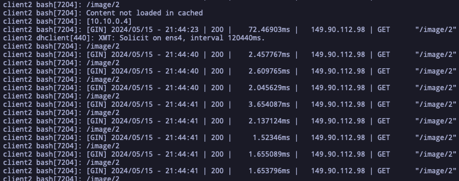
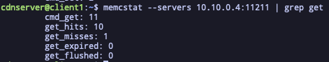
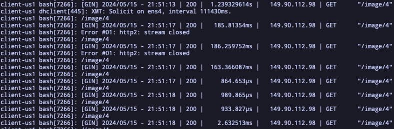
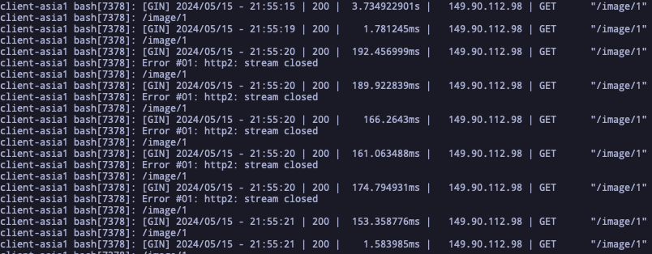

# Decentralized Virtual CDN 

> This project was developed by Jorge Mendes up202308811@up.pt and José Carvalho up202005827@fc.up.pt As part of the semester project for the Cloud System Administration class in the Master's program in Network and Information Systems Engineering at the Faculty of Science, University of Porto, This document outlines the architecture for a decentralized virtual Content Delivery Network (CDN) with opportunistic offloading. It details the technology stack and the rationale behind each choice, aiming to provide a scalable, efficient, and secure solution capable of handling global traffic with minimized latency and enhanced user experience.

## Table of Contents
- [Introduction](#introduction)
- [Architecture design](#architecture-design)
  - [Architecture decisions](#architecture-decisions)
  - [Self-managed applications VS GCP-managed applications](#self-managed-applications-vs-gcp-managed-applications)
  - [Security](#security)  
- [Application and Performance analysis](#application-and-performance-analysis)
- [Infrastructure costs](#infrastructure-costs)
  - [Persistant disk Storage](#persistant-disk-storage)  
  - [Networking](#networking)  
  - [Cloud storage data transfer](#cloud-storage-data-transfer)  
  - [Computing](#computing)  
- [Configurations](#configurations)
- [Conclusion](#conclusion)

### Introduction
Content delivery networks (CDNs) play a vital role in modern web infrastructures, offering several key functionalities through the deployment of globally distributed servers to deliver web content and media. CDN architecture functions by routing user requests to the closest server, thus enhancing load times and reducing latency during data transmission. Additionally, Caching systems are commonly utilized within this architecture to store frequently requested content in memory, thereby minimizing the need for unnecessary API calls to the backend servers and databases. This strategic use of caching systems is important for reducing infrastructure and bandwidth costs by alleviating the load on origin servers.
Moreover, CDNs are recognized for their scalability, reliability, and robust security capabilities, making them an integral component of web infrastructures.
Making the service reliable and scalable usually involves creating multiple servers distributed by several regions. However, the decision to create several nodes poses may be a costly approach for companies that want to serve CDN services. 

This project aims to architect and deploy a Content Delivery Network(CDN) in Google Cloud Platform to host the infrastructure. Moreover, unlike the common CDS provider's approach,  this project will cache the content requested by each client locally considering a maximum of 100MB of memory and share it with other peers in the same region. This type of architecture that uses the clients as web servers and caching servers brings down the infrastructure costs tremendously and ensures the scalability of the application as well as the latency and bandwidth per request. Furthermore, this project will involve architectural decisions such as GEC vs Kubernetes vs APP engine solutions to deploy the backend application, how the infrastructure is provisioned and configured, scalability and analytical cost analysis of each component that makes part of this architecture.

### Architecture design

Since the goal is to simulate a CDN provider, the project was deployed in 3 different regions Iowa (us-central1), Tokyo (asia-northeast1) and the Netherlands (europe-west4). Furthermore, we assumed the European region as the primary region where we expect that will come the most load. Therefore we decided ideally to keep the costs as low as possible to deploy the backend service remaining in only one region.
The architecture diagram poses 3 core components the Backend, the Reverse Proxy and the Clients/Frontend 

The backend component is composed by a GO application created using the GIN web framework which is a high-performant framework to create the REST API and handle database connections. The database is a MariaDB instance deployed in a separate node that stores the filename uploaded by the user and the bucket path in which the file was stored. To ensure data persistence in cases where eventually, the database goes offline it was created separately a persistent volume of 20GB.

Similarly, the Client/Frontend is also a Go application with the GIN web framework that is capable of making API calls, listing the available files in the Databases and downloading the content from the bucket. Additionally, the client has a Memcached server which is configured to save content up to 100MB and is a crucial component to grant high performance in content delivery throughout the online clients. The caching system has several particularities. One of them is that clients when caching content should be capable of sharing the content to all the other clients that are present in the same private network or same region. To achieve this, the client needs to know in the first place which clients are also in the same network and how to know which content the peer has in the caching server. Thus, we used the Google Cloud Platform messaging queue service Pub/Sub which is similar to SQS from AWS. This service receives messages on a Topic and dispatches the message to subscribed nodes. The message queue announces when a new node joins the network or caches a requested content from the bucket.  
The client announcement message only occurs once per client to avoid flooding the network with unnecessary packets over the private network, thus, each node knows only a portion of which peers belong to the network however, at the end of the day, every node maintains the same content cached. After the message is dispatched to a subscriber, the node stores the client's private address in a list and iterates over its cached content in order to populate the peer caching server. On the other hand, when a client requests content that is not in the memcached server, it requests directly to the backend bucket to download the content, present it to the user and store it in the localhost Memcached server and also to the list of peer's Memcached servers.

Finally, the reverse proxy is a Nginx server and functions as a connector between the clients and proxies the API calls to the backend servers. Moreover, the reverse proxy is deployed in a publicly accessible network or a DMZ network to keep packets that are not HTTPS or SSH away from the private subnet where is the webserver and the database.
 

#### Architecture decisions
The architectural decisions for this project employ the need to define the requirements and priorities. Therefore we decided to address the project by defining the performance in content delivery with low latency, multi-region support, reduced costs to deploy the solution, reliability and scalability as the core requirements. Moreover, we will also compare some available tools and delve into the whys that lead to our choices.

#### Self-managed applications VS GCP-managed applications
Google Cloud Platform has several technologies that ease the deployment scalability and microservices lifecycle such as Kubernetes GKE and APP engine or regarding database management, Cloud SQL. However, we still decided to use Virtual machines to host the backend application and database. This decision conveys several reasons and the strongest is the high price of these services provided by GCP which is the trade-off to have an on-demand, reliable and easy-to-deploy ecosystem where everything is automated per se. Therefore, since one of our requirements is the infrastructure cost optimization we decided to go for a lower-level solution that allows building a customizable service adequate to the workflow defined previously. Moreover, a good example is the price of a GKE cluster with a minimal setup of 3 nodes with an f1-micro family which has 1vcpu and 1GB costs `$92,72/month` considering the specs there is not much room for a lot of applications running simultaneously in a node. On the other hand, using virtual machines for only `$74,58/month` we have the same 3 E2-Medium instances with 1vcpu and 4GB of memory. The differences are considerable not only in the price but also in terms of available resources. The possible drawback when using virtual machines is the lack of elasticity by not using 

Additionally, the cloud SQL with MySQL service with only one instance with 1vcpu and 4GB of memory costs alone `$59,11/month`. However, since this is a GCP-managed service, the resource is provisioned in a VPC managed by Google and is accessible through public Networks or using VPC peering connections to link both VPCs to create private connectivity which represents extra networking costs.

#### Security

Security is a highly important matter that requires well-defined architecture decisions to ensure that resources are highly available,  protected and customer connectivity establishment with backend servers remains private. Therefore, the implementation poses some security architect concepts that ensure these security standards. For instance, every region VPC has 2 subnets the 192.168.0.0/24 subnet that allows ingress traffic on ports 22 and 443. On the other hand, the subnet 10.10.0.0/24 besides ports 443 and 22 also allows the ingress traffic to ports 11211 and 3306 which is isolated from the outside. The 11211 port is where the cache is exchanged between clients in turn, the 3306 is where the backend server connects to the database service.


#### Application and Performance analysis
The backend server is accessed through the reverse proxy that in turn forwards the request to the backend server in the path `https://<rproxy_ip>/backend` and will be presented with a web form which allows users to upload multiform files (images, videos, txt, etc...), 

 

After the user successfully uploads the file it will be stored in a bucket  and the metadata related to the file like the filename, the file type(image, video and other) and the bucket path will be inserted into the database

Furthermore, the backend also provides a interface `https://<rproxy_ip>/api` where he can select files, remove files and access Rest-API.

 

On the client side will the webserver in the localhost query the Rest-API to present the list of files available to download.



When the user requests a file that is not present in the local Memcached server, the client-server requests the file stored in the cloud storage bucket. This process takes some time, especially before caching the content and even more in regions outside of Europe.



The performance for European clients is smooth with request times of `72ms` which is great, after caching the content, and the request times.



On the other hand, for the US and Asia region, the first request time is expectedly higher with `1s` and `3s` of response time respectively. However, after caching the content the following requests-times dropped substationally.





#### Infrastructure costs

##### Persistant disk Storage
| Application | size | Cost/Month |
| -------- | -- |------- |
| Database storage     | 50GB | $0.80 |
| cloud storage (bucket) for content storage    | 100GB | $1.86 |
| cloud storage (bucket) for storing terraform state files   | 10GB | $0.19 |

##### Networking 
| Data transfer  |  Cost |
| --------      |------- |
| Data transfer to a different Google Cloud zone in the same Google Cloud region when using the internal or external IP addresses     | $0.01 |

###### Cloud storage data transfer
| Data transfer from Eu bucket to:  |  Cost |
| -------- |------- |
| Europe   | $0.02/GB |
| US       | $0.05/GB |
| Asia     | $0.08/GB |

###### VPC data transfer
| Data transfer out from Eu, US ans Asia vpcs to: | monthly usage | Cost monthly |
| -------- | --- |------- |
| US       | 0-1 TiB | $0.12/GB |
| Europe   | 0-1 TiB | $0.12/GB |
| Asia     | 0-1 TiB | $0.12/GB |

##### Computing
| Application | Number of Instances | Instance Family type | cpu | memory | Boot disk size | Cost/Month |
| --------      |--| --- | --- | ---- |-- |------- |
| Backend       | 1 | e2-micro | 0.25 | 1GB | 20GB | $6.11 |
| Client        | 1 | e2-micro | 0.25 | 1GB | 20GB | $6.11 |
| Database      | 1 | e2-micro | 0.25 | 1GB | 20GB | $6.11 |
| Reverse proxy | 1 | e2-micro | 0.25 | 1GB | 20GB | $6.11 |


#### Configurations

Create ssh keyfiles
```bash
cd Decentralized-Virtual-CDN-fcup/infra
ansible-playbook -i inventory build_project/ssh_keys.yaml  -vv
```
Create tls certificates
```bash
ansible-playbook -i inventory build_project/tls.yaml  -vv
```


The variables used in both ansible and terraform are set on cluster_configuration.yml file in order to make the project dynamic and adjustable. Finally, it also creates the tf_state bucket that will store all terraform states generated by each module that terraforms provisiones. This ansible execution accepts as a command the option apply or destroy.
```bash
ansible-playbook -i inventory build_project/main.yaml  --extra-vars "command=apply"   -vv
```


```bash
./executor.sh base apply emea
./executor.sh db apply emea
./executor.sh webserver apply emea
./executor.sh client apply emea
./executor.sh client apply asia
./executor.sh client apply us
```
To provision the whole infrastructure that will host the Reverse proxy the clients the backend server and the the database the previous bash script executes terraform commands base on the module that can be `base` in emea that creates the vpc subnets firewall rules the reverse proxy instance and the GCP messeging queue. The `db` module provisions the DB instance, the persistant volume, and cloud storage bucket that will store the files.
the `webserver` and client module provisions the backend and the client instance respectively.
Furthermore the available locations are emea (europe), asia, and US.


After provisioning resources with terraform it is needed to install dependencies, configure the services
```bash
ansible-playbook -i inventory db/main.yaml --tags db_init,db --key-file "../ssh_keys/idrsa" -vv
ansible-playbook -i inventory webserver/main.yaml --tags webserver_init,webserver,service --key-file "../ssh_keys/idrsa" -vv
ansible-playbook -i inventory reverse_proxy/main.yaml --tags rproxy_config,rproxy --key-file "../ssh_keys/idrsa" -vv
ansible-playbook -i inventory client_app/main.yaml --tags client_init,client,client_config,memcached --key-file "../ssh_keys/idrsa" -vv
ansible-playbook -i inventory build_project/main.yaml  --extra-vars "command=destroy"   -vv
```
#### Conclusion

In the process of designing and implementing a Content Delivery Network (CDN), several key steps are involved, including defining architecture requirements and carrying out the implementation. The project entailed the deployment of a CDN server that leverages client devices to act as a frontend server, along with a caching server responsible for storing and distributing requested content among other clients within the same private network. This approach aimed to minimize infrastructure costs associated with multi-region services, thus ensuring low latency in content distribution and enhanced service reliability. In terms of scalability, the architecture was designed to accommodate a minimum of one node in each component, with the ability to scale up the number of nodes based on the required workload capacity, albeit without automated processes. The overall performance results revealed significant improvements, particularly in regions outside of Europe, where response times decreased from 1-3 seconds to mere milliseconds, attributed to the implementation of the Memcached caching system.
